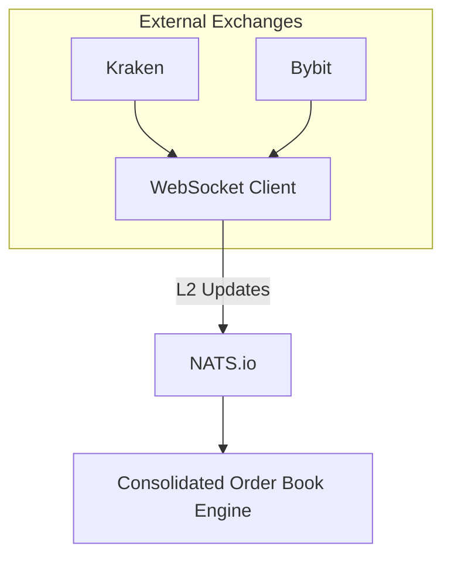
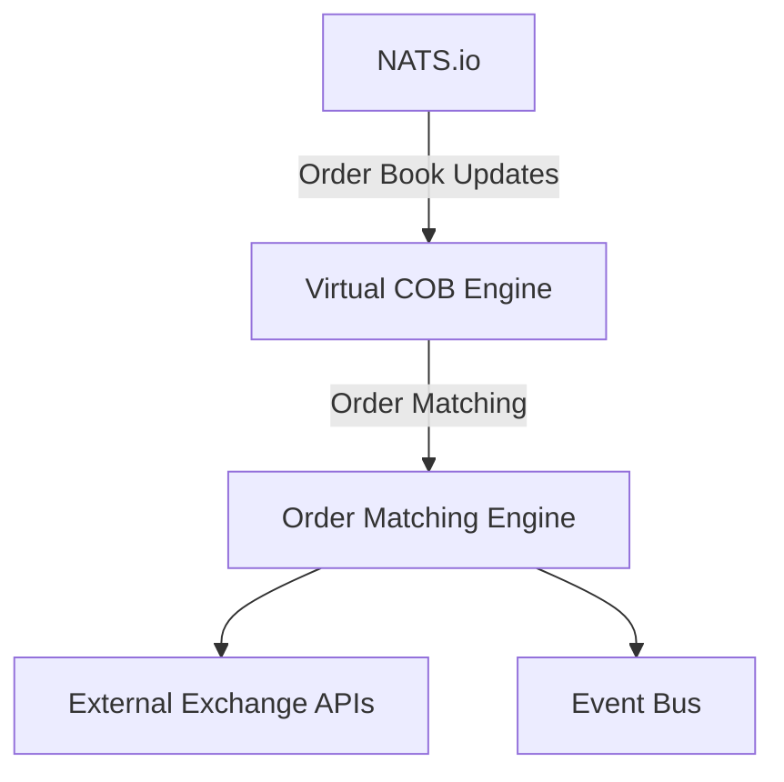
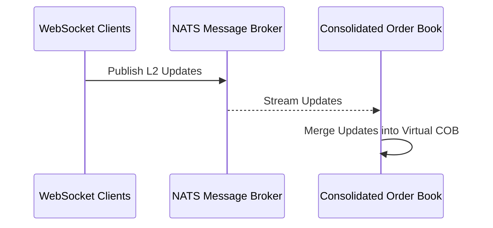
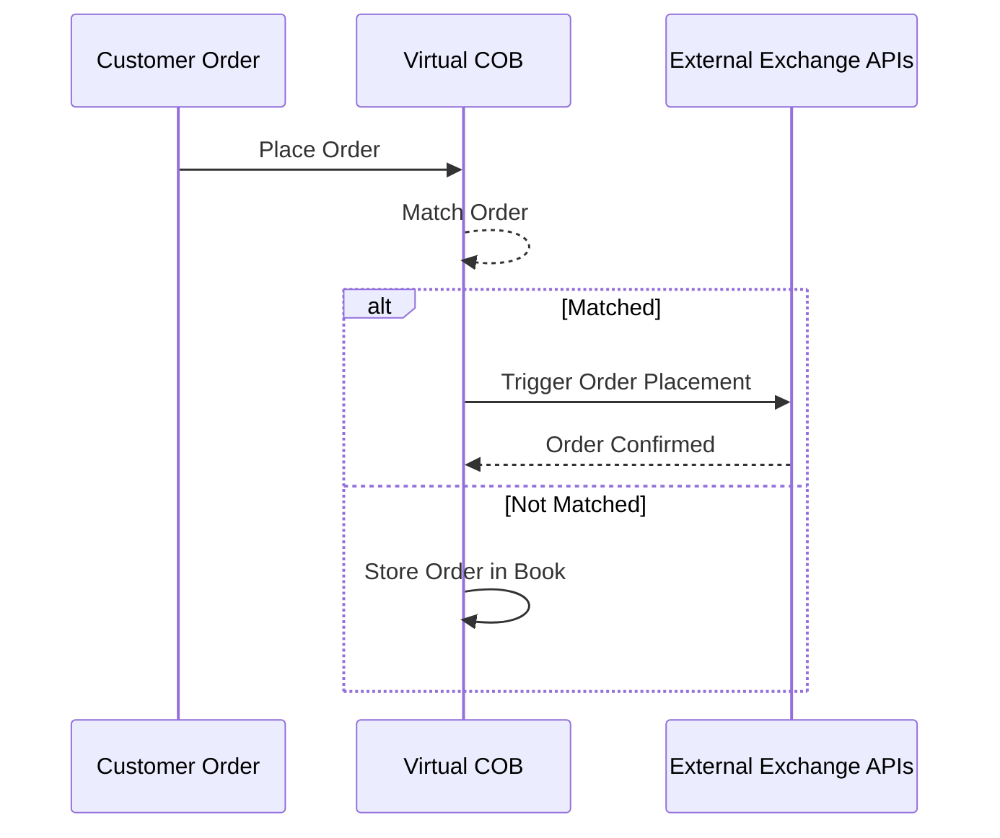

# **Consolidated Order Book (COB) - Liquidation Engine**

## **Overview**

This repository implements a **Consolidated Order Book (COB)** that serves as a **real-time liquidation engine** for a crypto exchange platform.
The COB aggregates order books from multiple external exchanges (e.g., Kraken, Bybit) and processes user-initiated orders on the platform.
When an order matches, the system triggers placing corresponding orders on external exchanges while taking into account available balances, volumes, and order splitting.

The system is built for low-latency, high-throughput, and real-time decision-making to ensure efficient liquidity management.

---

## **Key Features**

1. **Real-time Order Book Synchronization**:

   - Syncs Level 2 (L2) order books from multiple external exchanges via WebSockets.
   - Updates a virtual **COB** that merges these order books into a unified view.

2. **Customer Order Matching**:

   - Processes orders initiated by platform customers.
   - Matches customer orders against the **best available prices** in the virtual COB.
   - Orders remain in the book if not immediately matched.

3. **Automated Liquidation and Order Splitting**:

   - When matched, triggers API calls to external exchanges to place real orders.
   - Splits large orders across multiple exchanges to optimize execution based on volume and balances.
   - Ensures balances on external exchanges are respected.

4. **Event-Driven Architecture**:

   - Emits events on successful matches and order placement for downstream systems (e.g., accounting, reporting).

5. **Fault Tolerance**:
   - Handles out-of-sequence updates from exchanges.
   - Supports periodic snapshots for resynchronization.

---

## **Architecture**

The system consists of the following components:

### **1. WebSocket Clients**

- **Purpose**: Connect to external exchanges (e.g., Kraken, Bybit) and receive L2 order book updates in real time.
- **Responsibilities**:
  - Normalize incoming data to a unified schema.
  - Publish order book updates (snapshots and deltas) to a message broker.



### **2. Message Broker** (NATS.io)

- **Purpose**: Decouple components and facilitate real-time updates.
- **Responsibilities**:
  - WebSocket clients publish updates to NATS subjects.
  - The COB engine subscribes to relevant subjects and processes updates concurrently.

### **3. Consolidated Order Book Engine (COB)**

- **Purpose**: Maintain a unified, virtual order book by merging external exchange order books and platform orders.
- **Responsibilities**:
  - Aggregate and update price levels from multiple exchanges.
  - Process user-initiated orders.
  - Match orders efficiently.
  - Fire events when orders are matched and trigger real API calls to external exchanges.



#### **Core Operations**:

| **Operation**        | **Description**                                                           |
| -------------------- | ------------------------------------------------------------------------- |
| Order Ingestion      | Process incoming snapshots and deltas from external exchanges.            |
| Order Matching       | Match customer orders against the best available prices in the COB.       |
| Order Placement      | Place corresponding orders on external exchanges via API.                 |
| Order Splitting      | Split large orders across multiple exchanges to optimize execution.       |
| Balances Management  | Check and respect available balances on external exchanges.               |
| Querying Top of Book | Retrieve the best bid/ask prices and quantities in real time.             |
| Fault Tolerance      | Resynchronize periodically and handle out-of-sequence updates gracefully. |

---

## **Data Structures**

The COB engine relies on a combination of efficient data structures:

1. **Price Level Representation**:

   ```go
   type PriceLevel struct {
       Price      float64  // Price level
       Quantity   float64  // Total available quantity at this price
       Exchange   string   // Source exchange (e.g., Kraken, Bybit)
   }
   ```

2. **Order Book**:

   - Maintains separate books for **bids** and **asks**.
   - Uses:
     - **Balanced Binary Search Tree** (for ordered price levels).
     - **Hash Map** (for fast lookups and updates).
     - **Min/Max Heap** (for retrieving best bid/ask efficiently).

3. **Virtual Consolidated Book**:

   - Combines multiple exchange order books into a unified view.
   - Structures:
     ```go
     type VirtualOrderBook struct {
         Bids map[float64]*PriceLevel // Bid price levels (keyed by price)
         Asks map[float64]*PriceLevel // Ask price levels (keyed by price)
     }
     ```

4. **Buffered Channels**:
   - For concurrent ingestion of updates from WebSocket clients.
   - Example: `updates := make(chan PriceUpdate, 1000)`

---

## **Workflow**

### **1. Real-time Synchronization**

1. WebSocket clients receive updates from external exchanges.
2. Updates are normalized into a unified format.
3. WebSocket clients publish these updates to NATS subjects.



### **2. Order Book Update**

1. The COB engine subscribes to NATS subjects.
2. Updates are applied to the **virtual COB**:
   - Insert or update price levels.
   - Remove price levels with zero quantities.

### **3. Customer Order Processing**

1. A customer places an order on the platform.
2. The order is:
   - Checked for immediate matches in the virtual COB.
   - If matched:
     - The engine triggers **API calls** to external exchanges to place corresponding orders.
     - The order may be split across multiple exchanges based on volumes and balances.
   - If not matched:
     - The order is placed into the virtual COB until it is matched.



---

## **Key Technologies**

| **Component**          | **Technology**               |
| ---------------------- | ---------------------------- |
| Language               | Go (Golang)                  |
| WebSocket Clients      | Custom implementation        |
| Message Broker         | NATS.io                      |
| Real-time Order Book   | Balanced BST, Hash Map, Heap |
| API Integration        | REST APIs (Kraken, Bybit)    |
| Concurrency Management | Go Routines, Channels        |

---

## **Future Improvements**

1. **Order Routing Optimization**:
   - Implement intelligent routing algorithms to minimize latency and trading costs.
2. **Load Balancing**:
   - Introduce horizontal scaling for the COB engine.
3. **Persistence**:
   - Add database persistence for fault recovery and historical order book analysis.
4. **Advanced Matching Algorithms**:
   - Optimize order matching for high-frequency trading (HFT).
5. **Monitoring and Logging**:
   - Implement real-time monitoring, metrics, and logging.

## Resources

- [Go maps in action](https://go.dev/blog/maps) (go.dev blog)
- [Go heap](https://pkg.go.dev/container/heap@go1.23.4) (Go Standard library container heap)
